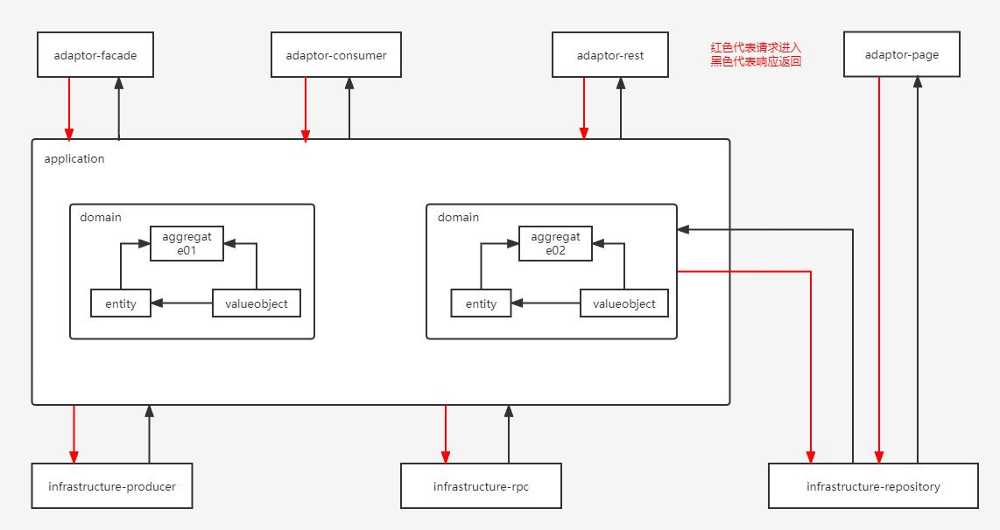

## DDD 实践
### 领域分层图

### 运行项目
- 运行`DddSampleApplication`
### 代码骨架
```
${base}
├── ${base}-bootstrap -- 启动模块
└── ${base}-adaptor -- 适配器模块，用于主动适配
     ├── ${base}-adaptor-consumer -- 消息消费方适配器
     ├── ${base}-adaptor-rest -- rest 协议适配器, 使用 rest 协议, 默认本地端口 10086
     ├── ${base}-adaptor-page -- 分页查询适配，分页和列表查询不经过 domain
     ├── ${base}-adaptor-facade -- rpc 协议适配器, 用于主动适配，对外暴露接口
     ├── ${base}-adaptor-... -- 其他的主动适配器，按需添加 module 即可
└── ${base}-application -- 应用层，服务编排     
└── ${base}-domain -- 领域层
     └── ${bizModuleName} -- 业务模块名称
         ├── model -- 聚合根、实体、值对象
         ├── enums -- 聚合相关枚举
         ├── errorcode -- 聚合相关错误码
         ├── factory -- 工厂, 产生聚合根对象
         ├── integration -- 领域层需要调用外部服务来进行业务操作时，在 domain 中构建需要的模型，在 integration 层的实现中跟外部服务做类型转换
         ├── repository -- 资源库, 跟聚合根一对一
         ├── service -- 存在模型间的关系处理，通常是模型本身处理不了的业务逻辑，以 XXXDomainService 和 XXXDomainServiceImpl
└── ${base}-common 通用逻辑，如日志打印，管理 rpc 的工具，web filter等。common 会依赖所有的外部 facade，方便管理。
└── ${base}-infrastructure -- 基础设施目录，用于被动适配
     ├── ${base}-infrastructure-repository -- 资源库实现层，与 DB 交互
     ├── ${base}-infrastructure-producer -- 消息发送方适配器
     ├── ${base}-infrastructure-rpc -- rpc 协议适配器, 用于被动适配，主要给 domain 层的对外交互提供转换，详见: RemoteUserIntegration
     └── ${base}-infrastructure-... -- 其他的被动适配器，按需添加 module 即可
```
### 核心原则
- domain 层的依赖尽可能少（只用一些通用工具的，如 utils、spring、lombok）
- 凡是能够放在实体（聚合根、实体、值对象）中的业务逻辑, 不要放到 domainService 中
- 凡是能够放在 domainService 中的业务逻辑，不要放到外层 service 中
- 返回结果调用使用`ResultUtils.success()`或`ResultUtils.failed()`生成
- adaptor 目录下的 module 间不允许相互引用
### ID生成器
在`DddSampleApplication`中引入代码（默认使用雪花算法）:
```java
public class DddSampleApplication {
    @Bean
    public void snowBallGenerator() {
        SnowBallGenerator.init(1);
    }
}
```
